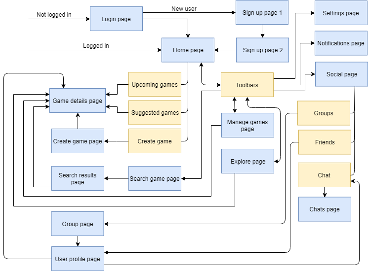

Proposed Level of Achievement: Apollo 11

# **_Android application: Sportal_**

An all-in-one Android app to solve all your sports match-finding needs

## **_IDEATION_**

### **Problem Motivation**:

	

There are several problems currently faced by people who frequently play/have a desire to play sports:

*   Not enough players to form a full game of a team sport
*   Finding pickup games can be messy and disorganized
*   Difficult for new players of a sport to find actual opportunities to play
*   Difficulties in scheduling a proper game and managing the list of players who can make it 
*   Hard to find a group of like-minded individuals to be able to play a sport you enjoy together

As of present, we feel like there is a lack of a centralized platform for sports players to arrange and find proper matches with other players. In addition,  if you want to organize a match, you have to coordinate time, location, and other details with all players and manage a list of who can make it, as well as disseminate important information with the players attending. 

### **User Stories:**

1. As a match organizer who already has a venue and some/zero players already interested in playing, I want to be able to easily find more players to make up the amount needed to start a proper game.

2. As a sports player, I want to be able to quickly find a joinable match that conforms to my constraints, such as time and location requirements.

3. As a new sport player, I want to be able to find matches of the appropriate skill level which are also welcoming of new players.

4. As a sports player/match organizer, I want to be able to easily communicate with players in the same game as me to settle details or simply have a chat.

5. As a sports venue owner, I can promote my venue to groups of sport players by organizing matches when my venue is unbooked.

## **_Project Scope_**

### **Aim**:

Our objective is to provide a service that addresses the above issues in an Android application that emphasizes convenience and ease-of-use by:

1. Providing said centralized platform for players to set-up and join games.

2. Providing an integrated service to communicate, coordinate and manage all the details regarding the game.

### **Projected Technologies Used:**

### **Core Features:**

(To be done by 3rd week of June)

1. **User accounts**
*   Personalize your profile and let other users know more about you
2. **Create new games**
*   Create your own game
*   Choose your preferred sport, time, venue and players needed
3. **View/manage games**
*   View and manage existing games
*   Leave games that you are no longer interested in
4. **Game page**
*   View game details
*   View other participants
*   Real-time message board to disseminate information or interact with other users
5. **Search and join existing games**
*   Find a suitable game to join.
*   Search based on sport type, location, time, skill level and more

### **Supplementary Features:**

(To be done by mid July)

1. **Explore page**
*   Get recommendations for possible games to join
*   Find out what�s happening near you
2. **Chat function**
*   Interact with other users on a more personal level
*   Make new friends
3. **Friends/groups and group search**
*   Add other users as friends
*   Form groups with other users
*   Search for games with your friends
*   View and post on your friends� activity feeds
4. **Incognito matchmaking**
*   Unable to find any suitable games?
*   Let the app search for games in the background and notify you once a game is found
5. **Sports venue finder**
*   Get suggestions for sports venues
6. **User profile and feed**
*   Find out more about fellow users and see what your friends have been up to!

## **_Program Overview_**

**Application flowchart:**

Blue boxes: App pages  
Yellow boxes: Overlays and Fragments
